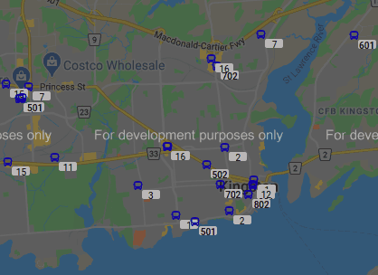

## Introduction
  
This is to show Kingston Transit Buses' position on Google map in real-time
- Backend
    - Kafka Source Connector (JDBC); Kafka Connect REST api used in Java
    - Kafka Stream in Java
    - Kafka Consumer in Java
    - Jetty Server-side Websocket
    - PostgreSQL
- Frontend
    - React
    - [Node.js Client-side Websocket](https://www.npmjs.com/package/websocket)
    - [google-map-react](https://www.npmjs.com/package/google-map-react)

## Data flow


## Running Backend
1. Go To Directory 'backend'

1. Run Kafka, PostgresSQL Docker image
    ```
    docker-compose up -d
    ```

1. Run Java applications
    - Setup Kafka Connect : Run main method in ConnectAPI.java
        - Need few minutes before running since docker containers need time to boot up. You should be able to see messages like below if successful. If not, try to run again few minutes later
        ```
            [main] INFO com.github.sijoonlee.connector.ConnectAPI - Using GET
            [main] INFO com.github.sijoonlee.connector.ConnectAPI - RESP STATUS CODE: 200
            [main] INFO com.github.sijoonlee.connector.ConnectAPI - RESP STATUS BODY: ["vehicles"]
        ```
    - Get GTFS real time data: Run main method in GtfsRealtimeKingston.java
    - Setup Kafka Stream : Run main method in VehicleStream.java
    - Server up Websocket : Run main method in WSServer.java

## Running Frontend
1. Run React Server
```
npm run start
```
- Bus icons will be shown up on the map after few seconds

## Clean up
1. Shutdown docker containers
```
docker-compose down --volumes
```


    